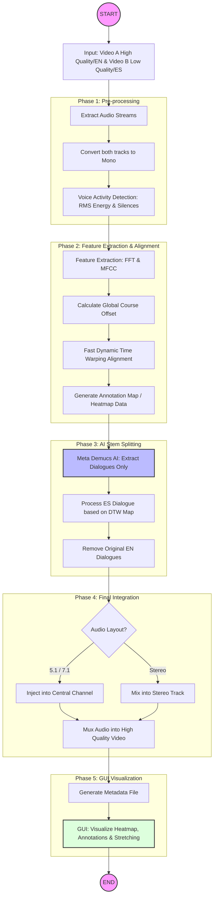

# DubSync - Audio Voice Synchronization CLI

DubSync is a powerful CLI tool designed to synchronize and replace vocal tracks in multi-channel audio files. It is specifically optimized for replacing a center-channel vocal track (e.g., English) with an AI-separated vocal track from another source (e.g., Spanish) while maintaining the original surround sound environment.

## Architecture

The system is built upon several core components:

1.  **FFmpeg Integration**: Handles a wide variety of input formats (DTS, Opus, WAV, FLAC) and manages multi-channel layout manipulation.
2.  **DubSync Stem Core**: A local Rust library (`dubsync-stem`) that provides AI-powered audio separation using the Demucs model via ONNX Runtime (ORT).
3.  **Stream API**: Utilizes a streaming buffer architecture to process audio in chunks, allowing for real-time progress tracking and low memory overhead.
4.  **Aubio Synchronization**: (In Development) Employs `aubio-rs` for onset detection and tempo analysis to precisely align the target vocals with the original source's timing.
5.  **Checkpoint System**: A JSON-based state management system that tracks progress across processing stages, allowing for recovery if the process is interrupted.

## Pipeline Overview



## Processing Procedure

The conversion follows a strict 4-stage pipeline to ensure quality and consistency:

### 1. Main Audio Extraction (Analysis)
- **Input**: Multi-channel source (e.g., 7.1 DTS).
- **Process**: Extracts the audio into a high-fidelity intermediate format.
- **Goal**: Identify the center channel (C) which typically contains the primary dialogue.

### 2. Target Vocal Separation (Demucs)
- **Input**: Target language source (e.g., Opus).
- **Process**: Uses the `StreamSplitter` API to process the audio in 16KB chunks.
- **Output**: High-quality "Vocals" stem separated from background music/noise.
- **Progress**: Tracked via console output for each chunk processed.

### 3. Temporal Synchronization (Fragment Alignment)
- **Input**: Clean English Vocals + Clean Spanish Vocals.
- **Process**:
    1.  Extracts vocal stems from BOTH English and Spanish sources using Demucs.
    2.  Identifies "dialogue fragments" (non-silent blocks) in both streams using energy analysis.
    3.  Pairs Spanish fragments to the nearest English fragments in the timeline.
    4.  Aligns the Spanish fragments to the exact start/center of their English counterparts.
- **Goal**: Ensures that even if the Spanish audio has a different overall duration or offset, each individual dialogue block is correctly placed to match the original scene timing.

### 4. Final Surround Recomposition
- **Input**: Original Surround channels (L, R, LFE, SL, SR, etc.) + Synced Target Vocals.
- **Process**: Replaces the original center channel with the new synced vocals.
- **Output**: Final FLAC file with preserved surround layout.

## Progress Tracking & Checkpoints

Progress is tracked in real-time. If the process is cancelled, the `progress_checkpoint.json` file stores the state of completed stages:

- `main_processed`: Step 1 completion.
- `target_processed`: Step 2 completion.
- `sync_completed`: Step 3 completion.

Rerunning the command will automatically resume from the last successful checkpoint.

## Development with Pixi

This project uses [Pixi](https://pixi.sh) to manage its development environment, including Rust, FFmpeg, and CUDA/cuDNN dependencies.

### Setup
```bash
# Install dependencies and create environment
pixi install
```

### Running Tasks
```bash
# Run the synchronization pipeline
pixi run run --main <INPUT> --target <TARGET> --output <OUTPUT>

# Run GPU diagnostic
pixi run check-gpu
```

## Docker Configuration

You can build a containerized version of DubSync that includes all optimized libraries:

```bash
docker build -t dubsync .
```

To run with GPU support:
```bash
docker run --gpus all -v /srv/nfs/shared:/data dubsync \
  --main /data/english.dts \
  --target /data/spanish.opus \
  --output /data/final.flac
```

## License

Licensed under either of:

- Apache License, Version 2.0 ([LICENSE-APACHE](LICENSE-APACHE) or http://www.apache.org/licenses/LICENSE-2.0)
- MIT license ([LICENSE-MIT](LICENSE-MIT) or http://opensource.org/licenses/MIT)

at your option.

---

### Acknowledgments

This project utilizes the Hybrid Transformer Demucs model architecture, originally developed by Meta Research.
